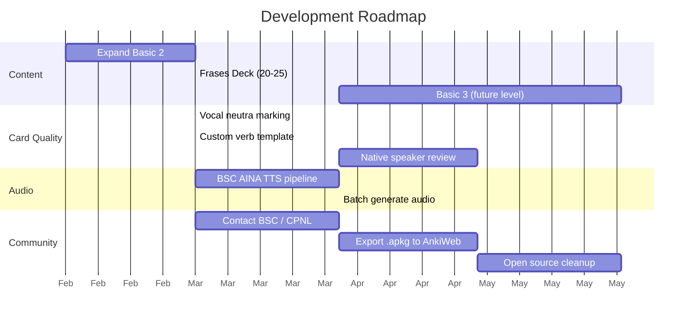

# Anki Català — Brainstorming & Roadmap

## Current State

| Deck               | Cards | Status                    |
| ------------------ | ----- | ------------------------- |
| cpnl basic 1 [dev] | 177   | Cleaned, enriched, tagged |
| cpnl bàsic 2 [dev] | 12    | Started, needs expansion  |
| Verbs Essencials   | 19    | Polished with conj tags   |

Tooling: Python + AnkiConnect client with upsert, clone, dump, audit scripts.

## Prioritization Matrix

|                                | 🟢 Easy (1 session)         | 🟡 Medium (2-3 sessions)      | 🔴 Hard (ongoing / external) |
| ------------------------------ | --------------------------- | ----------------------------- | ---------------------------- |
| **🔥 High Impact**             | **2.** Vocal neutra marking | **1.** Frases cloze deck      | **5.** BSC AINA audio        |
| _(directly improves learning)_ | **4.** Expand Basic 2       | **3.** Custom verb template   | **9.** Package for CPNL      |
|                                | **11.** Reverse cards       | **6.** LLM card generator     | **14.** PDF textbook parser  |
| **⭐ Medium Impact**           | **8.** CLI upsert tool      | **7.** Auto-correction linter | **10.** Open source toolkit  |
| _(improves workflow/quality)_  |                             | **13.** Reverse cloze phrases | **12.** Analytics dashboard  |

### Recommended Order

| Priority      | Feature                   | Why first?                                     |
| ------------- | ------------------------- | ---------------------------------------------- |
| **Now**       | **2.** Vocal neutra       | Tiny effort, immediate pronunciation benefit   |
| **Now**       | **4.** Expand Basic 2     | You need more cards for current class          |
| **Next**      | **1.** Frases deck        | Biggest learning upgrade — context practice    |
| **Next**      | **11.** Reverse cards     | Easy toggle on existing cards                  |
| **Soon**      | **3.** Verb template      | Makes verb cards much cleaner                  |
| **Soon**      | **8.** CLI tool           | Speeds up all future card additions            |
| **Parallel**  | **5.** BSC AINA audio     | Can scope independently while building content |
| **Later**     | **6.** LLM generator      | Once card format is stable                     |
| **Later**     | **7.** Linter             | Once there's enough content to lint            |
| **Long-term** | **9, 10.** CPNL packaging | After content is teacher-reviewed              |

---

## Feature Ideas

### 🟢 Ready to Build (next sessions)

#### 1. Frases Deck (Cloze Deletions)

A dedicated deck using Anki's **Cloze note type** for sentence practice.

- 3-5 phrases per vocab theme, not one per word
- `{{c1::la samarreta}}` blanks force active recall in context
- Same tags as vocab decks (`roba`, `alimentació`, etc.)
- Start with 20-25 phrases covering strongest vocab areas

#### 2. Pronunciation Marking (Vocal Neutra + Silent Letters)

Two visual markers for pronunciation traps on cards:

**CSS classes** (added once to card template):

```css
.vn {
  color: #e67e22;
  text-decoration: underline;
} /* vocal neutra: orange underline */
.sl {
  color: #999;
  text-decoration: line-through;
} /* silent letter: grey strikethrough */
```

**Helper functions** (for card generation scripts — fewer tokens than raw HTML):

```python
vn("petit", [0])   → "p<span class='vn'>e</span>tit"   # marks neutral vowel
sl("temps", [3])   → "tem<span class='sl'>p</span>s"    # marks silent letter
```

##### Catalan Stress Rules (for identifying which vowels reduce)

| Word ends in...                  | Stress on...            | Example      |
| -------------------------------- | ----------------------- | ------------ |
| Vowel, `-s`, `-en`, `-in`        | Second to last syllable | ca·**di**·ra |
| Other consonant                  | Last syllable           | car·**rer**  |
| Has accent (à, é, è, í, ó, ò, ú) | Accented syllable       | ca·ta·**là** |

##### Vowel Reduction (Eastern Catalan)

Only **unstressed** `a`, `e`, `o` change — `i` and `u` never change:

| Vowel | Stressed   | Unstressed           |
| ----- | ---------- | -------------------- |
| **a** | [a] normal | [ə] weak "uh"        |
| **e** | [e] / [ɛ]  | [ə] same "uh"        |
| **o** | [o] / [ɔ]  | [u] sounds like "oo" |

##### Examples

| Word           | Stressed syl. | Reduces         | You hear   |
| -------------- | ------------- | --------------- | ---------- |
| p**e**tit      | pe·**TIT**    | `e` unstressed  | "pə·TIT"   |
| b**o**tiga     | bo·**TI**·ga  | `o` + final `a` | "bu·TI·gə" |
| c**a**rrer     | ca·**RRER**   | `a` unstressed  | "cə·RRER"  |
| c**a**t**a**là | ca·ta·**LÀ**  | both `a`s       | "cə·tə·LÀ" |

##### Implementation plan

1. Add CSS to card template (one-time)
2. Build `vn()` and `sl()` helpers in a shared `card_helpers.py`
3. Apply to existing cards where relevant (prioritize common traps)
4. Use in all new card generation going forward

#### 3. Custom Verb Card Template

Replace the current `<br>`-separated conjugation with a proper HTML table note type.

- New note type: `Catalan Verb` with fields: `Spanish`, `Catalan`, `Jo`, `Tu`, `Ell`, `Nosaltres`, `Vosaltres`, `Ells`, `Tense`, `Group`
- Styled table layout instead of `&nbsp;` spacing hacks
- One note = one verb × one tense (expandable to multiple tenses later)

#### 4. Expand Basic 2

- More vocab from current class topics
- Structured like Basic 1 (chunk cards for related words, individual cards for key terms)

---

### 🟡 Medium-Term (requires some setup)

#### 5. BSC AINA Audio Integration

Use the Matxa TTS model from Projecte AINA (BSC) for native Catalan pronunciation.

- **Cost**: Free for non-commercial use (Hugging Face / REST API)
- **Pipeline**: Extract Catalan text → TTS → `.mp3` → `storeMediaFile` via AnkiConnect → `[sound:file.mp3]` in card template
- **Effort**: ~1 session to build pipeline, then batch-generate for all cards
- **Parallel track**: Contact BSC/AINA team about the project, see if they'd support it

#### 6. LLM Card Generator

Feed a topic to Gemini → generates cards with correct gender, forms, example sentence.

- Input: theme + level (e.g., "transport, A2")
- Output: structured card data → pushed to Anki via existing pipeline
- Needs manual review before committing (LLMs hallucinate Catalan)

#### 7. Auto-Correction Linter

Run all cards through an LLM to flag: wrong genders, misspellings, false friends, incomplete forms.

- Could cross-check against Optimot (Generalitat's official Catalan dictionary)
- Output: report of suspected errors with suggestions

#### 8. CLI Tool (`anki_upsert.py`)

Single command-line tool for adding/updating cards without writing scripts:

```
python anki_upsert.py --deck "cpnl basic 1" --front "Cuchara" --back "La cullera" --tags "casa"
```

Also supports CSV/YAML bulk import.

---

### 🔵 Long-Term / Community Goals

#### 9. Package for CPNL Students

Export polished decks as `.apkg` files and share:

- **AnkiWeb shared decks**: one-click download for any Anki user
- **CPNL alignment**: map vocabulary to official CPNL syllabus per level
- **Teacher review**: have a native speaker verify all content
- **Licensing**: CC-BY-SA for open sharing

#### 10. Open Source Toolkit

Clean up the GitHub repo for community contribution:

- Vocabulary stored as YAML/CSV (not hardcoded in Python)
- `python build_decks.py` generates all decks from data files
- README with setup guide, contribution instructions
- CPNL teachers could submit corrections via GitHub Issues/PRs

#### 11. Reverse Cards (Català → Castellà)

Add Catalan→Spanish direction for mastered vocabulary.

- Use "Basic (and reversed card)" note type
- Or create a separate filtered deck for reverse practice

#### 12. Learning Analytics Dashboard

Pull Anki review stats via AnkiConnect → visualize:

- Cards mastered per tag/theme
- Accuracy trends over time
- Weakest categories needing more cards

#### 13. "Basic (and reversed card)" for Phrases

Once phrases are solid, create Catalan→Spanish cloze cards too.

#### 14. PDF Textbook Parser + Unit Tagging

Parse the CPNL course textbooks (PDF) to auto-generate cards aligned to each unit.

- Extract vocabulary lists, example sentences, and grammar points per unit
- Tag every card with `unitat::01`, `unitat::02`, etc.
- **Non-intensive students** can filter by unit to match their weekly pace
- **Intensive students** can study all units at once
- Pipeline: PDF → text extraction (PyMuPDF / pdfplumber) → LLM structuring → card generation
- Teacher could validate unit mapping against syllabus
- Could auto-generate Frases cloze cards from textbook example sentences

---

## Parallel Tracks



## Stakeholders to Contact

| Who                 | Why                                                        | When                     |
| ------------------- | ---------------------------------------------------------- | ------------------------ |
| Your CPNL teacher   | Content review, syllabus alignment, gauge student interest | Soon                     |
| BSC / Projecte AINA | TTS partnership, visibility for their project              | After MVP with audio     |
| CPNL administration | Potential institutional adoption                           | After teacher validation |

---

## Notes

- User is at CPNL A2.2 level, taking intensive classes
- Preference for chunk cards (multiple related words per card) over individual cards
- Spanish speaker (Argentine Spanish) learning Catalan in Barcelona
- Has data/analytics background — can build tooling but also values practical study utility
